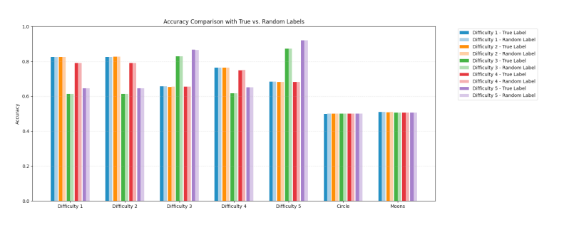

# Numerical In-Context Learning for Clustering with Linear Transformers

This repository contains code developed for my undergraduate thesis on **in-context learning with linear Transformers** applied to **numerical clustering tasks**.  

## 📂 Repository Structure

### `src/`
- **train.py** – training entry point  
- **eval_cluster.py** – evaluation of clustering tasks  
- **conf/** – YAML configs for models and tasks  

---

## ⚙️ Setup

Create the conda environment from `environment.yml`:

```bash
conda env create -f environment.yml
conda activate num-cluster
```

## 🚀 Usage

1. Training

Run training on clustering tasks:

```bash
python src/train.py --config src/conf/cluster_2d.yaml # change xd for different dimention
```

2. Evaluation

Evaluate a trained model:

```bash
python src/eval_cluster.py --config src/conf/cluster_2d_eval.yaml
```


## 📊 Results
	•	Models perform well at template matching (memorizing cluster examples seen in context).
	•	Generalization to new clustering rules or shapes is limited.
	•	Behavior suggests linear Transformers act more like memory-based pattern matchers rather than learners of universal clustering functions.

The 2 figures show the decision boundary diagrams of models trained at 0 steps, 30,000 steps, 250,000 steps, and 500,000 steps on four types of distributed data:


Visualization of decision areas under perturbation of prompt order:


A comparison chart of accuracy between true labels and random labels:



A Comparison of indicators between contextual learning models and classical models: 


